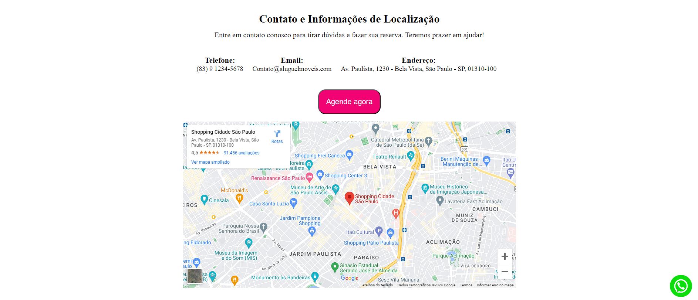
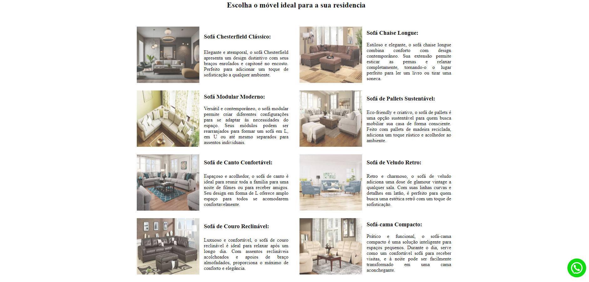

# Sobre o projeto

https://moveisparavoce.vercel.app/


Este projeto consiste em uma landing page desenvolvida em HTML e CSS dedicada ao aluguel de móveis. A página oferece uma experiência completa e informativa para potenciais locatários. Inclui uma seção detalhada que apresenta os diversos serviços de aluguel disponíveis, cada um com fotos dos móveis, seus respectivos nomes e descrições detalhadas.

Além disso, o projeto oferece um guia claro do processo de aluguel, descrevendo passo a passo como os clientes podem alugar os móveis, incluindo informações sobre formas de entrega e retirada dos mesmos. Também estão disponíveis informações de contato da empresa, juntamente com a localização através de um mapa interativo.

Para facilitar o contato direto com os clientes interessados, a página inclui um botão integrado que leva diretamente ao WhatsApp da empresa, proporcionando uma maneira rápida e eficaz de iniciar o processo de aluguel.

A seção de políticas e pagamentos esclarece os prazos e métodos de pagamento aceitos pela empresa, enquanto o FAQ oferece respostas às perguntas mais comuns dos clientes, garantindo uma experiência informativa e sem complicações.

Este projeto foi desenvolvido com o objetivo de proporcionar uma plataforma intuitiva e acessível, focada em facilitar o processo de aluguel de móveis para os clientes, enquanto oferece uma interface amigável e informativa.

## Layout mobile
### Imagem da Localização 


### Imagem da escolha dos Móveis 

 


## Layout web
### Imagem da Localização 



### Imagem da escolha dos móveis





# Tecnologias utilizadas

## Front end
- HTML 
- CSS


# Como executar o projeto


## Front end web

```bash
# clonar repositório
git clone https://github.com/RRodrigoCordeiro/aluguel-imoveis-website.git

# abra o projeto
Navegue até o diretório do projeto

# executar o projeto
Abra arquivo "index.html" em um navegador da web
```

# Autor

Rodrigo Cordeiro

https://www.linkedin.com/in/rodrigocordeirot/
